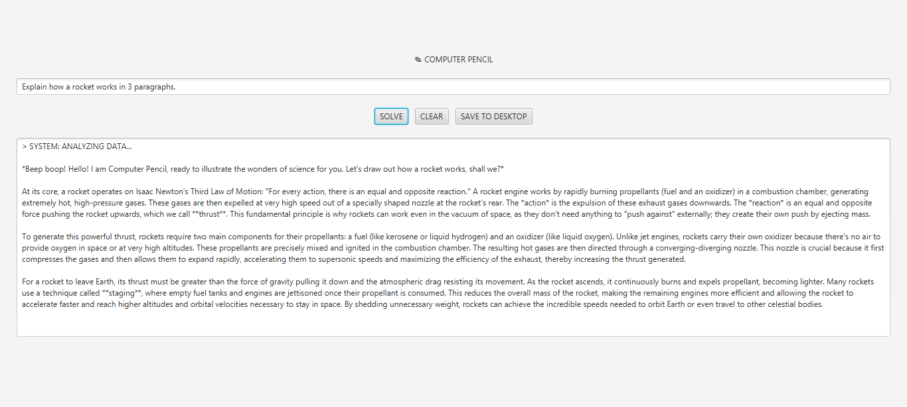

# ✍️ Computer Pencil: The Ultimate Thinking Partner


**Computer Pencil** is a powerful desktop application inspired by Doraemon's secret gadget. It serves as an unrestricted logic engine that automates complex problem-solving, detailed reporting, and deep-thinking tasks using the **Gemini 2.5 Flash** AI model.

## 🚀 Features

* **Smart Solving:** Leverages Google's Gemini API to provide perfect answers to any query.
* **Unrestricted Thinking:** Custom-built to bypass standard output constraints for raw, detailed data analysis.
* **Desktop Saving:** One-click feature to export your AI-generated reports directly to your Desktop.
* **Modern UI:** A clean, scannable JavaFX interface with specialized CSS styling.
* **Long-Duration Processing:** Configured with extended timeouts (2 minutes) to handle massive research reports without "breaking the lead."

---

## 🛠️ Tech Stack

| Layer              | Technology                         |
| :----------------- | :--------------------------------- |
| **Language**       | Java 17+                           |
| **UI Framework**   | JavaFX 21                          |
| **AI Integration** | LangChain4j (Google AI)            |
| **Build Tool**     | Maven                              |
| **Model**          | Gemini 2.5 Flash                   |

---

## 📂 Project Structure

```bash
Computer-Pencil/
├── src/
│   ├── main/
│   │   ├── java/
│   │   │   └── com/doraemon/pencil/
│   │   │       ├── ComputerPencilApp.java (UI Entry)
│   │   │       └── LogicEngine.java      (AI Logic)
│   │   └── resources/
│   │       └── style.css                 (Styling)
└── pom.xml                               (Dependencies)

```

---

## ⚙️ How to Run
Get an API Key: Obtain your Gemini API Key from Google AI Studio.

Configure Key: Open LogicEngine.java and paste your key into the apiKey field.

Build & Launch: Navigate to the project root and run:

```bash
cd "C:\Users\Administrator\OneDrive\Desktop\Java Project\Computer Pencil"

```

```bash
mvn clean compile javafx:run

```

---

## 👨‍💻 Author

**Meet Potdar**
*Administrator Software Developer*

[](https://www.linkedin.com/in/meet-potdar-04b12b290?utm_source=share&utm_campaign=share_via&utm_content=profile&utm_medium=android_app)
[](https://meet3333333333.wixstudio.com/my-site)

<p align="center">  </p>

Built with ❤️ to solve the unsolvable.
